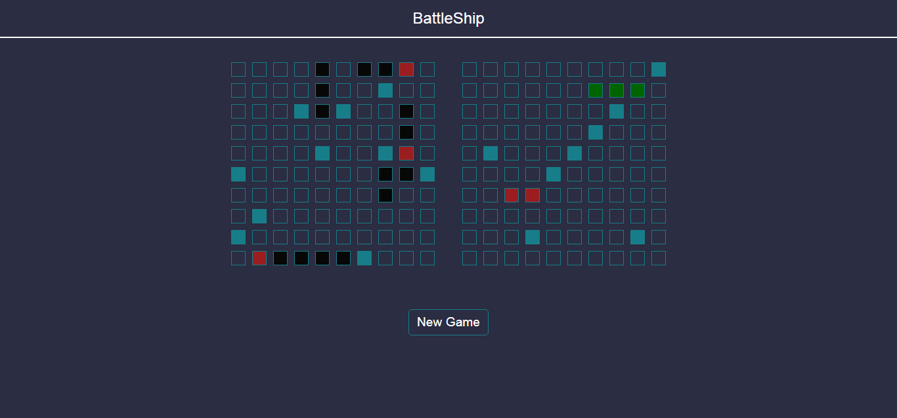
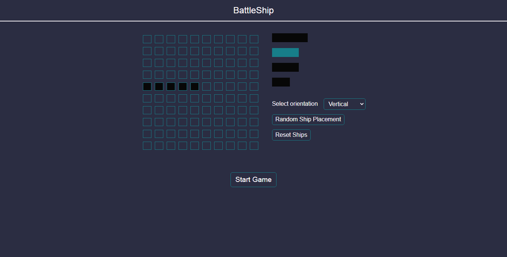

# Battleship
A web app to the play the Battleship game.

Made as part of [The Odin's Project Curriculum](https://www.theodinproject.com/paths/full-stack-ruby-on-rails/courses/javascript/lessons/battleship)

[Live Demo Here](https://peter-abah.github.io/battleship/)

## Overview
The battleship is a single player game against the computer in which computer makes random moves.

The main purpose of this project was to practice testing with jest.

### How To Play

- Select ships and select position to place them on the board.
- Or click the **Random ships placement** button to place ship on board randomly.
- Click the **Reset ships** button to clear board of ships and place the ships again.
- After placing all five ships click **Start game** button to start the game.
- Click on a position on the computer board to make a move.
- Blue indicates missed shot.
- Red indicates there is ship at that position.
- Green indicates the ship has been sunk.
- If all the computer's ship has been sunk, You win.
- Click the **New game** button the start again.

### Built with
- HTML
- CSS
- JavaScript
- Webpack
- Jest

## Screenshots

# Acknoledgements

- [The Odin's Project](https://www.theodinproject.com/)
